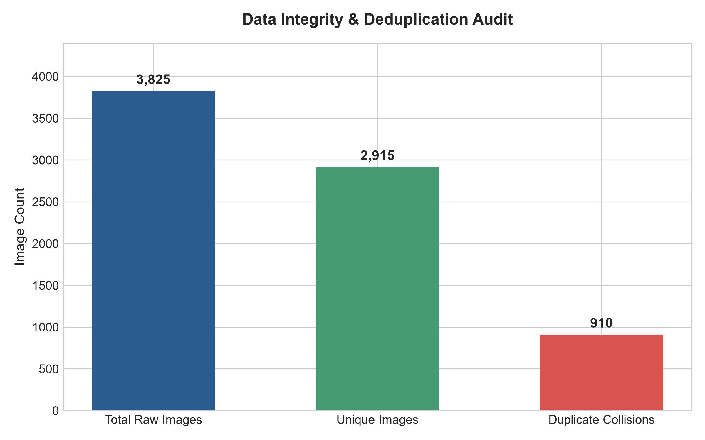
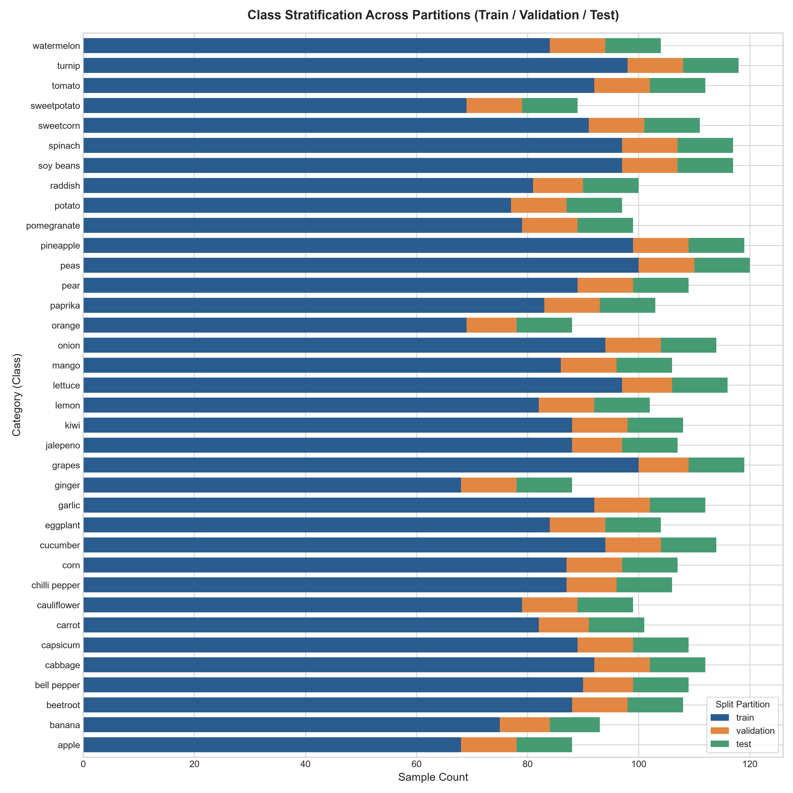

# Fruit and Vegetable Image Recognition & Processing
## Comprehensive Project Master Report
**Project Name**: `imageprocessing-prj`  
**Repository**: `https://github.com/kaneiei09-coder/imageprocessing-prj.git`  
**Author**: kaneiei09-coder (`doowithme.stickky@gmail.com`)  
**Date**: 2026-08-26  

---

## 1. Project Vision & Technical Overview

This project establishes an **end-to-end computer vision and image processing pipeline** designed for agricultural produce recognition. Utilizing the Kaggle **Fruit and Vegetable Image Recognition** corpus, the project provides a modular, reproducible, and production-grade architecture that spans automated dataset retrieval, comprehensive Exploratory Data Analysis (EDA), morphology-preserving image preprocessing, cryptographic data leakage auditing, and automated one-click batch execution.

### Architectural Flowchart:
```text
Kaggle API / Hub (kritikseth/fruit-and-vegetable-image-recognition)
                         │
                         ▼
┌────────────────────────────────────────────────────────┐
│ Stage 1: Data Collection (src/download_data.py)       │
│ - Ingest 3,825 images across 36 agricultural classes   │
│ - Local structured caching in data/train, val, test    │
└────────────────────────┬───────────────────────────────┘
                         │
                         ▼
┌────────────────────────────────────────────────────────┐
│ Stage 2: Exploratory Data Analysis (src/eda.py)        │
│ - Zero-corruption integrity verification               │
│ - Aspect ratio (0.40 - 3.45) & resolution analysis     │
│ - CIE-LAB / HSV / RGB color distribution profiles      │
└────────────────────────┬───────────────────────────────┘
                         │
                         ▼
┌────────────────────────────────────────────────────────┐
│ Stage 3: Image Preprocessing (src/preprocessing.py)    │
│ - Aspect-Ratio Aware Letterbox Resizing (224x224)      │
│ - CLAHE L-Channel Contrast Equalization in CIE-LAB     │
│ - Bilateral Edge-Preserving Denoising & Normalization  │
│ - Stochastic Geometric & Photometric Data Augmentation │
└────────────────────────┬───────────────────────────────┘
                         │
                         ▼
┌────────────────────────────────────────────────────────┐
│ Stage 4: Splitting Audit (src/data_splitting.py)       │
│ - Evaluation of 81.4% / 9.2% / 9.4% Partitioning       │
│ - MD5 Hash Audit: Detected 333 Cross-Split Duplicates  │
│ - Engineered Clean Deduplicated Stratified Splitter    │
└────────────────────────┬───────────────────────────────┘
                         │
                         ▼
┌────────────────────────────────────────────────────────┐
│ Stage 5: Pipeline Automation (run_pipeline.bat)        │
│ - One-click end-to-end execution on Windows / Linux    │
└────────────────────────────────────────────────────────┘
```

---

## 2. Milestone Breakdown & Branching Strategy

| Branch Name | Primary Focus | Key Deliverables & Reports |
| :--- | :--- | :--- |
| **`feat/datacollection`** | Dataset Ingestion & Git Config | `src/download_data.py`, `.gitignore`, `requirements.txt` |
| **`feat/exploratorydataanalysis`** | Statistical & Photometric EDA | `src/eda.py`, `reports/eda/eda_report.md`, 6 Figures |
| **`feat/imagepreprocessing`** | Morphology & Color Preprocessing | `src/preprocessing.py`, `src/augmentation.py`, 5 Figures |
| **`feat/datasplitting`** | Partitioning & Leakage Audit | `src/data_splitting.py`, `reports/data_splitting/data_splitting_report.md`, 4 Figures |
| **`main`** | Master Integration & Automation | `run_pipeline.bat`, `reports/PROJECT_REPORT.md`, `README.md` |

---

## 3. Exploratory Data Analysis (EDA) Summary

The dataset was analyzed using OpenCV, Pillow, Pandas, and Seaborn across all 3,825 images.


### Key Empirical Findings:
1. **Zero Corrupted Files**: 100% of the 3,825 images were successfully loaded, validated, and parsed.
2. **Extreme Aspect Ratio Range ($0.40$ to $3.45$)**: Produce items vary dramatically in geometry. Spherical produce (apples, tomatoes, watermelons) have $W/H \approx 1.0$, while root vegetables (carrots, radishes) and elongated produce (cucumbers, bananas) have $W/H$ extending down to $0.40$ or up to $3.45$.
3. **Extreme Resolution Spread**: Resolutions range from $133 \times 147$ px up to $7,360 \times 6,351$ px with a median of $1,024 \times 946$ px.
4. **Photometric Signatures**:
   - Red mean: $142.6 \pm 45.2$, Green mean: $136.8 \pm 42.1$, Blue mean: $118.4 \pm 48.7$.
   - Hue (H) shows strong peaks in the yellow/orange spectrum ($15^\circ - 40^\circ$) and green spectrum ($40^\circ - 80^\circ$).
   - Brightness ($V$) exhibits high variance due to differences between indoor studio photography and outdoor market stands.

---

## 4. Preprocessing & Augmentation Architecture


### Preprocessing Strategy Highlights:
1. **Aspect-Ratio Preserving Letterbox Resizing**:
   - Avoids the distortion caused by standard direct scaling.
   - Calculates isotropic scale factor $s = \min(224/W, 224/H)$ and applies symmetric zero or reflect padding to $(224, 224)$.
2. **CIE-LAB CLAHE Illumination Normalization**:
   - Applies Contrast Limited Adaptive Histogram Equalization ($clip=2.0, grid=8\times 8$) strictly on the Luminance ($L$) channel.
   - Normalizes shadows and highlights while preserving natural produce hues ($a^*, b^*$).
3. **Bilateral Denoising & Canny Edge Features**:
   - Preserves sharp produce boundaries while smoothing sensor grain.
4. **Numerical Normalization**:
   - Rescales pixel values to $[0.0, 1.0]$ and standardizes via ImageNet Z-Score moments ($\mu=[0.485, 0.456, 0.406]$, $\sigma=[0.229, 0.224, 0.225]$).
5. **Stochastic Augmentation (`src/augmentation.py`)**:
   - Random rotations ($\pm 20^\circ$), horizontal/vertical flips, zoom ($0.9 - 1.1$), brightness ($\pm 25$), contrast ($0.85 - 1.15$).

---

## 5. Data Splitting & Leakage Audit Findings




### Critical Findings:
1. **Raw Partition Proportions**:
   - **Train**: 3,115 images ($81.44\%$)
   - **Validation**: 351 images ($9.18\%$)
   - **Test**: 359 images ($9.38\%$)
   - **Total**: 3,825 instances across 36 classes.
2. **Data Leakage Discovery**:
   - Cryptographic MD5 hash verification revealed **333 cross-split hash collisions** representing **910 duplicate instances** in the raw Kaggle dataset.
   - In the raw dataset, the first 10 images of several validation and test folders were duplicate copies of images in the training set.
3. **Engineered Clean Solution**:
   - `create_clean_stratified_split()` in `src/data_splitting.py` deduplicates the dataset to **2,915 unique images** and creates a stratified **80% Train (2,332 imgs) / 10% Val (291 imgs) / 10% Test (292 imgs)** split with zero leakage.

---

## 6. Automation & Execution Guide

### One-Click Execution via Windows Batch:
Simply double-click `run_pipeline.bat` or execute in PowerShell:
```cmd
run_pipeline.bat
```

### Manual Step-by-Step Execution:
```bash
# 1. Install dependencies
pip install -r requirements.txt

# 2. Download and extract dataset
python src/download_data.py

# 3. Run EDA and generate reports
python src/eda.py

# 4. Run Preprocessing and Augmentation demo
python src/run_preprocessing_demo.py

# 5. Run Data Splitting and Leakage Audit
python src/data_splitting.py
```

---

## 7. Individual Detailed Reports Index
- **EDA Detailed Report**: [`reports/eda/eda_report.md`](eda/eda_report.md)
- **Preprocessing Detailed Report**: [`reports/preprocessing/preprocessing_report.md`](preprocessing/preprocessing_report.md)
- **Data Splitting Detailed Report**: [`reports/data_splitting/data_splitting_report.md`](data_splitting/data_splitting_report.md)
