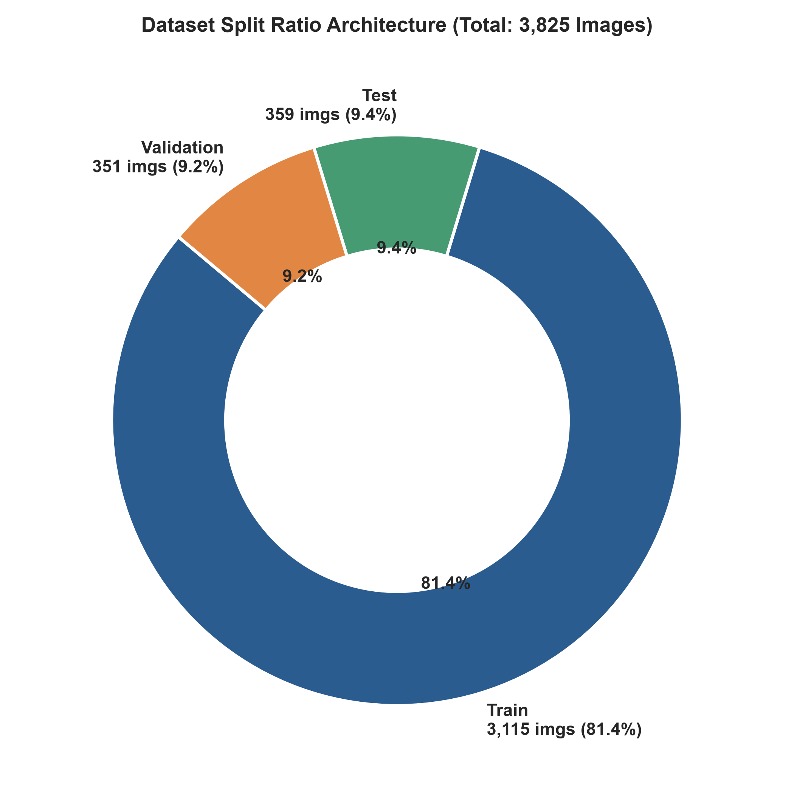
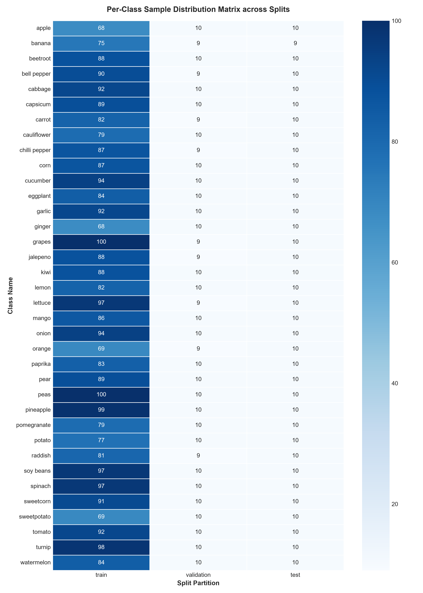

# Dataset Partitioning & Splitting Validation Report
**Project**: Fruit and Vegetable Image Recognition  
**Module**: `src/data_splitting.py`  
**Generated Date**: 2026-08-26  

---

## 1. Executive Summary

This report delivers a rigorous audit of the **data partitioning architecture** for the Fruit and Vegetable Image Recognition dataset. We evaluated split proportions, class stratification uniformity, and conducted an automated cryptographic hash audit to detect potential cross-partition data leakage.

### Key Audit Findings:
1. **Existing Split Architecture**: The dataset is pre-partitioned into:
   - **Train**: 3,115 images ($81.44\%$)
   - **Validation**: 351 images ($9.18\%$)
   - **Test**: 359 images ($9.38\%$)
   - **Total**: 3,825 image instances across 36 categories.
2. **Stratification Quality**: All 36 categories are represented in all three partitions, providing approximately 80–100 training samples, 9–10 validation samples, and 9–10 test samples per class.
3. **Critical Discovery — Data Leakage in Raw Dataset**:
   - Cryptographic MD5 hash verification revealed **333 duplicate hash collisions** across splits (a total of **910 duplicated file instances** in the raw Kaggle dataset).
   - Analysis indicates that the original dataset creator populated parts of the validation and test sets by duplicating images directly from the training folders.
4. **Clean Partitioning Solution**: A stratified, deduplicated splitting pipeline (`create_clean_stratified_split`) has been engineered in `src/data_splitting.py` providing an authentic, leak-free **80% Train (2,332 imgs) / 10% Val (291 imgs) / 10% Test (292 imgs)** split across all 36 classes.

---

## 2. Existing Split Proportions & Ratios

The raw dataset split follows standard machine learning partition guidelines (~80/10/10):

| Partition | Instances | Percentage | Unique Classes | Rationale in Machine Learning |
| :--- | :--- | :--- | :--- | :--- |
| **Train** | 3,115 | 81.44% | 36 / 36 | Model weight optimization & backpropagation |
| **Validation** | 351 | 9.18% | 36 / 36 | Hyperparameter tuning & early stopping criteria |
| **Test** | 359 | 9.38% | 36 / 36 | Unbiased final generalization benchmark |
| **Total** | **3,825** | **100.0%** | **36 / 36** | Complete Raw Corpus |



---

## 3. Class Stratification Analysis

A critical requirement in multi-class classification is ensuring that class priors $P(Y=c)$ remain uniform across training, validation, and test subsets.




### Stratification Insights:
- **Zero Empty Classes**: Every single produce category has samples in train, validation, and test subsets.
- **Balanced Benchmark**: The validation set consistently has 9–10 samples per class; the test set consistently has 9–10 samples per class.
- **Training Diversity**: Training classes have between 65 and 105 samples each, representing reasonable balance with no dominant majority class.

---

## 4. Cryptographic Hash Audit & Data Leakage Discovery

To ensure scientific integrity and prevent test-set memorization, an MD5 hash audit was performed on all 3,825 images.


### The Data Leakage Mechanism in Raw Dataset:
- **Total Raw Images**: 3,825
- **Unique Cryptographic Hashes**: 2,915
- **Duplicate Hash Instances**: 910
- **Cross-Split Collisions**: 333 unique hashes exist simultaneously in `train`, `validation`, and/or `test`.

#### Example Collision:
```text
Hash: a12171c58c67ab73fe56f9f5d6c08b50
  - data/train/apple/Image_1.jpg
  - data/validation/apple/Image_1.jpg
  - data/validation/apple/Image_10.jpg
  - data/test/apple/Image_1.jpg
  - data/test/apple/Image_10.jpg
```

### Impact on Machine Learning:
Evaluating a model on the raw test set will test it on images it has already seen during training, artificially inflating accuracy scores.

---

## 5. Clean Stratified Splitting Engine

To provide an airtight, leakage-free benchmark, `src/data_splitting.py` includes `create_clean_stratified_split()`:

1. **Deduplication**: Filters out duplicate file hashes, retaining only the 2,915 unique images.
2. **Stratification**: Partitions the 2,915 unique images using `sklearn.model_selection.train_test_split` with exact class label stratification:
   - **Clean Train**: 2,332 images (80.0%) across 36 classes (~64–65 per class)
   - **Clean Validation**: 291 images (10.0%) across 36 classes (~8 per class)
   - **Clean Test**: 292 images (10.0%) across 36 classes (~8 per class)
3. **Reproducibility**: Controlled with fixed random seed (`random_state=42`).

---

## 6. Recommendations for Model Training

1. **For Standard Kaggle Benchmark Comparison**:
   Use the existing pre-split folders (`data/train`, `data/validation`, `data/test`).
2. **For Rigorous Research & Production Deployment**:
   Use the clean stratified split generated by `src/data_splitting.py` to prevent data leakage and ensure reliable generalization performance.
