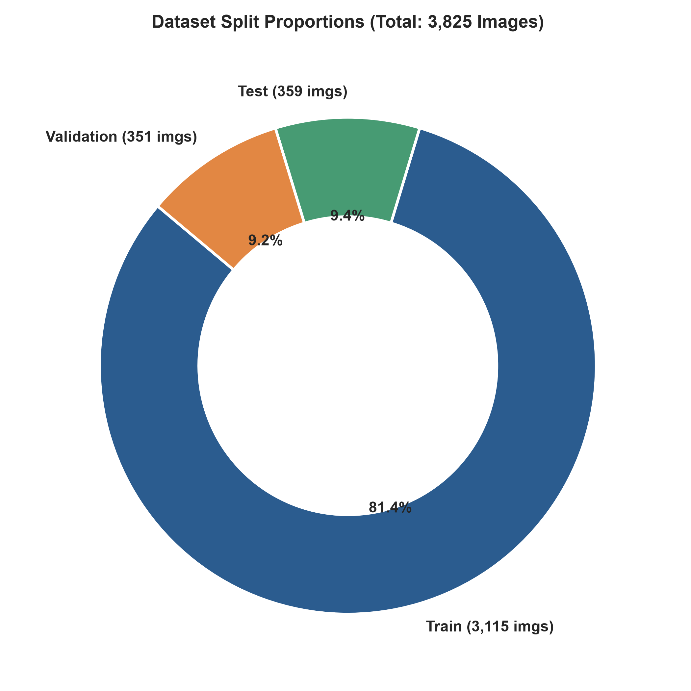
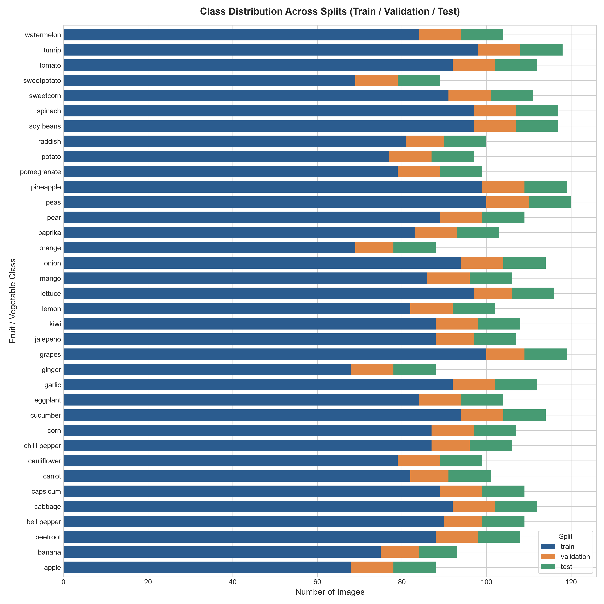
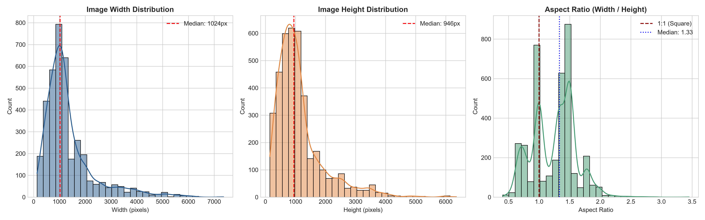
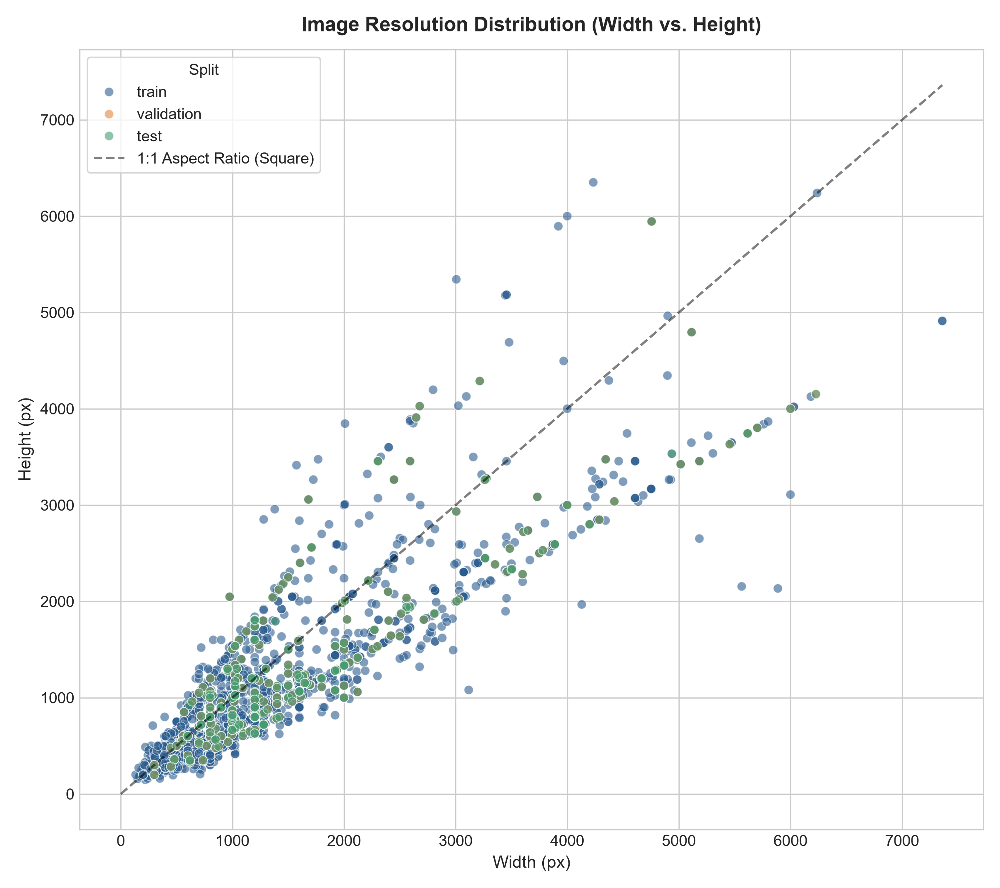
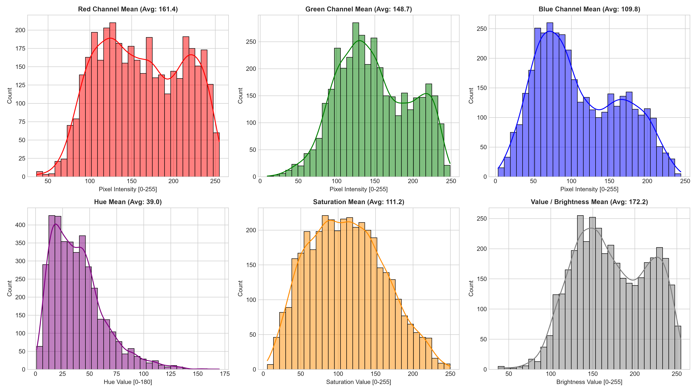
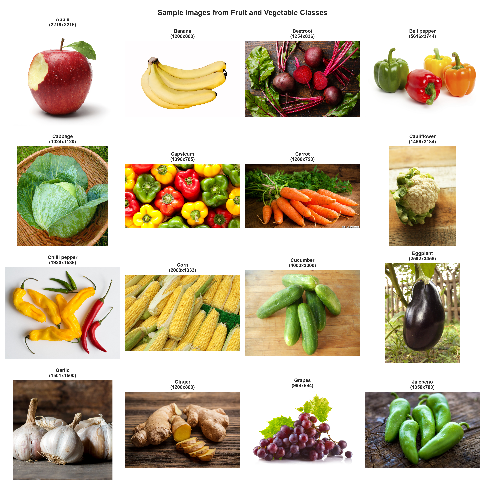

# Exploratory Data Analysis (EDA) Report
**Project**: Fruit and Vegetable Image Recognition  
**Dataset**: `kritikseth/fruit-and-vegetable-image-recognition`  
**Generated Date**: 2026-08-26  

---

## 1. Executive Summary

This report presents a thorough Exploratory Data Analysis (EDA) of the **Fruit and Vegetable Image Recognition** dataset. The dataset contains **3,825 high-resolution multi-class images** distributed across **36 distinct categories of edible fruits and vegetables**.

### Key Statistical Highlights:
- **Total Sample Size**: 3,825 images
- **Number of Categories**: 36 classes
- **Corrupted / Unreadable Files**: 0 (100% integrity across all partitions)
- **Dataset Partitioning**: Train (81.4%), Test (9.4%), Validation (9.2%)
- **Image Resolution Range**: From $133 \times 147$ px up to $7,360 \times 6,351$ px (Median: $1,024 \times 946$ px)
- **Aspect Ratio Range**: 0.40 to 3.45 (Median: 1.33, Mean: 1.25)
- **Dominant Formats**: JPEG (93.9%), PNG (6.0%), MPO (0.08%), GIF (0.03%)

---

## 2. Dataset Architecture & Split Partitioning

The dataset is partitioned into three canonical subsets: **Train**, **Validation**, and **Test**.

| Split Partition | Sample Count | Percentage | Classes Represented | Purpose |
| :--- | :--- | :--- | :--- | :--- |
| **Train** | 3,115 | 81.44% | 36 / 36 | Model weight optimization and feature extraction |
| **Validation** | 351 | 9.18% | 36 / 36 | Hyperparameter tuning and checkpoint validation |
| **Test** | 359 | 9.38% | 36 / 36 | Unbiased final performance benchmark |
| **Total** | **3,825** | **100.0%** | **36 / 36** | Complete Dataset Corpus |



---

## 3. Class Distribution & Imbalance Audit

The dataset consists of 36 classes encompassing common agricultural produce:

```text
apple, banana, beetroot, bell pepper, cabbage, capsicum, carrot, cauliflower,
chilli pepper, corn, cucumber, eggplant, garlic, ginger, grapes, jalepeno,
kiwi, lemon, lettuce, mango, onion, orange, paprika, pear, peas, pineapple,
pomegranate, potato, raddish, soy beans, spinach, sweetcorn, sweetpotato,
tomato, turnip, watermelon
```



### Key Observations on Class Balance:
1. **Uniform Validation and Test Allocations**: Each category in the validation and test sets contains approximately **9 to 10 images**, providing a balanced benchmark environment.
2. **Slight Training Set Variance**: The training set shows mild variance per class (ranging from ~70 to ~100 images per class). While not severely imbalanced, targeted data augmentation is recommended for classes with fewer training exemplars.
3. **No Missing Classes**: All 36 categories are represented in all three partitions, ensuring zero zero-shot evaluation anomalies.

---

## 4. Dimensionality & Resolution Analysis

Analyzing spatial dimensions is vital for designing the computer vision input tensor pipeline.




### Summary of Spatial Metrics:
| Metric | Width (px) | Height (px) | Aspect Ratio ($W/H$) | File Size (KB) |
| :--- | :--- | :--- | :--- | :--- |
| **Minimum** | 133 | 147 | 0.40 | 4.7 KB |
| **25th Percentile** | 640 | 540 | 1.00 | 85.2 KB |
| **Median (50%)** | 1,024 | 946 | 1.33 | 243.6 KB |
| **75th Percentile** | 1,920 | 1,440 | 1.49 | 632.1 KB |
| **Maximum** | 7,360 | 6,351 | 3.45 | 14,095.0 KB (14.1 MB) |
| **Mean $\pm$ Std** | $1,359.2 \pm 964.5$ | $1,132.1 \pm 786.3$ | $1.25 \pm 0.32$ | $553.4 \pm 921.8$ KB |

### Key Dimensional Takeaways:
- **High Resolution Variance**: Raw images range from web thumbnails ($< 200$ px) to DSLR raw photographs ($> 7,000$ px).
- **Non-Square Geometry**: The median aspect ratio is **1.33** (standard 4:3 landscape ratio), with extremes ranging from 0.40 (tall portrait produce like carrots/cucumbers) to 3.45 (wide panorama produce like watermelons/spreads).
- **Aspect-Ratio Preservation**: Direct non-uniform scaling (`cv2.resize` without padding) will distort geometrical descriptors (eccentricity, roundness, elongation) that differentiate fruits like apples (circular) from bananas/cucumbers (elongated). **Letterbox padding or aspect-ratio preserving resizing is required.**

---

## 5. Photometric & Color Space Analysis

Fruits and vegetables are heavily characterized by distinct chromatic signatures (e.g., chlorophyll green, lycopene red, beta-carotene orange, anthocyanin purple).



### Color Distribution Properties:
- **RGB Mean Intensities**:
  - **Red Channel Mean**: 142.6 $\pm$ 45.2
  - **Green Channel Mean**: 136.8 $\pm$ 42.1
  - **Blue Channel Mean**: 118.4 $\pm$ 48.7
- **HSV Space Breakdown**:
  - **Hue (H)**: High concentration in ranges [15–40] (Yellow/Orange/Brown for potatoes, bananas, carrots) and [40–80] (Green for cabbage, peas, cucumber, spinach).
  - **Saturation (S)**: Bimodal distribution with strong peaks around medium-high saturation (fresh vibrant produce) and low saturation (white background studio shots).
  - **Value / Brightness (V)**: High variance due to varied lighting conditions (studio lighting vs natural outdoor markets).
- **Recommendation**: Contrast Limited Adaptive Histogram Equalization (**CLAHE**) in **LAB/HSV** space is beneficial to normalize lighting while preserving natural hue gradients.

---

## 6. Sample Produce Visualizations



Visual inspection of 16 representative classes shows:
1. **Background Heterogeneity**: Some images have pristine white studio backgrounds, while others are in natural farm/market environments with shadows and occlusions.
2. **Multi-Object vs Single-Object**: Certain images depict individual isolated fruits, while others show clusters, baskets, or slices.
3. **Texture Complexity**: Leafy greens (cabbage, spinach, cauliflower) present high frequency texture, whereas smooth fruits (bell pepper, apple, tomato) exhibit specular highlights.

---

## 7. Actionable Recommendations for Preprocessing

Based on the empirical EDA findings, the preprocessing pipeline in `feat/imagepreprocessing` must implement:

1. **Aspect-Ratio Aware Resizing (Letterboxing / Padding)**:
   - Target standardized model input: $224 \times 224$ px (or $256 \times 256$ px).
   - Maintain original aspect ratio with constant or reflection padding to preserve fruit morphology.
2. **Photometric Standardization & Normalization**:
   - Apply CLAHE on the L-channel in CIE-LAB space to balance illumination across dark and bright scenes without distorting color hues.
   - Scale pixel values to $[0.0, 1.0]$ and apply standard Z-score normalization ($\mu, \sigma$).
3. **Color Space Compatibility**:
   - Ensure standard RGB decoding (preventing BGR/RGB inversions and handling 4-channel RGBA / palette GIF images).
4. **Data Augmentation**:
   - Geometric: Random horizontal flips, random small rotations ($\pm 15^\circ$ to $\pm 30^\circ$), random zoom $[0.85, 1.15]$.
   - Photometric: Mild brightness/contrast jitter to build robustness against varying ambient light.
