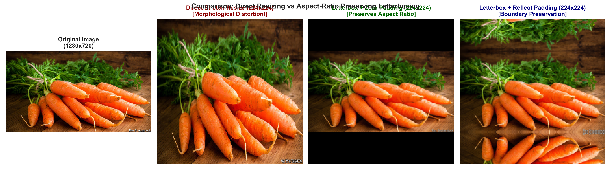
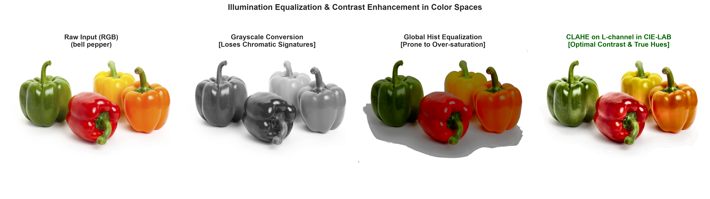
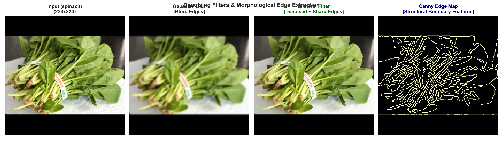
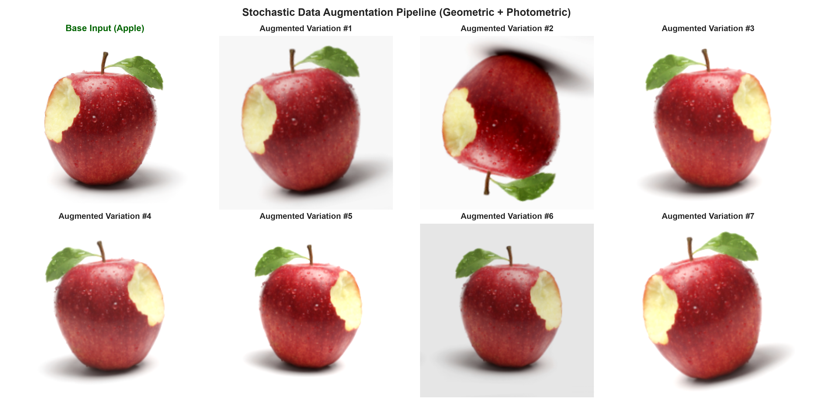
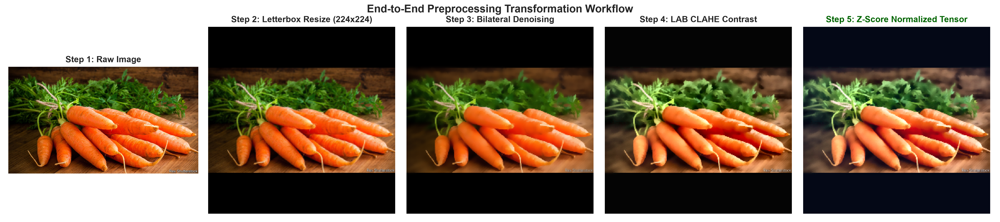

# Image Preprocessing & Data Preparation Report
**Project**: Fruit and Vegetable Image Recognition  
**Module**: `src/preprocessing.py`, `src/augmentation.py`  
**Generated Date**: 2026-08-26  

---

## 1. Executive Overview & Motivation

Following the empirical findings of the **Exploratory Data Analysis (EDA)**, images in the Fruit and Vegetable dataset exhibit three prominent computational challenges:
1. **High Aspect Ratio Variance ($0.40 - 3.45$)**: Produce items vary from elongated shapes (carrots, bananas, cucumbers) to spherical shapes (apples, watermelons, tomatoes).
2. **Illumination & Lighting Disparities**: Varied scene lighting between controlled studio photography and outdoor grocery market stands.
3. **Sensor Noise & Resolution Spread**: Resolutions span from $133 \times 147$ px to $7,360 \times 6,351$ px with diverse compression artifacts.

To solve these challenges and prime the dataset for computer vision / deep learning models (e.g. CNNs, Vision Transformers, OpenCV feature extractors), we have designed a **specialized, modular image preprocessing pipeline**.

---

## 2. Geometrical Standardization: Aspect-Ratio Preserving Letterboxing

### The Problem with Direct Resizing:
Standard `cv2.resize(image, (224, 224))` performs non-uniform affine scaling. When an elongated fruit (e.g., $Aspect\ Ratio = 2.5$) is forced into a square canvas ($1.0$), its structural aspect ratio and geometric descriptors (eccentricity, elongation) are deformed, corrupting shape-based discriminative features.

### The Letterboxing Solution:
Our `letterbox_resize` implementation:
1. Computes the isotropic scale factor: $s = \min(W_{target}/W, H_{target}/H)$.
2. Resizes the image using Area/Cubic interpolation without aspect ratio distortion.
3. Applies symmetric padding (constant black or reflection mode) to reach $(224, 224)$.



---

## 3. Photometric & Color Space Processing

Color is one of the most critical discriminative features in fruit and vegetable recognition (e.g., chlorophyll green, lycopene red, carotene orange).



### Why CIE-LAB CLAHE was Chosen over Alternatives:
- **Grayscale Conversion**: Discards chromatic signatures, making it difficult to distinguish an orange from a green apple of similar shape.
- **Global Histogram Equalization**: Applied globally across RGB or YUV, it produces unnatural hue shifts and over-saturated artifacts.
- **CLAHE on L-channel in CIE-LAB (Adopted)**:
  - Isolates Luminance ($L$) from chrominance channels ($a^*$ green-red and $b^*$ blue-yellow).
  - Enhances subtle surface texture (leaf veins, rind patterns, peel texture) while strictly preserving true color hues.

---

## 4. Denoising & Morphological Edge Extraction



### Filtering Strategy:
- **Bilateral Filtering (`cv2.bilateralFilter`)**: Unlike standard Gaussian blur which smooths across edges, bilateral filtering performs edge-preserving spatial and photometric smoothing. This suppresses digital camera noise while keeping fruit contours sharp and crisp.
- **Canny Edge Extraction**: Extracts structural boundaries ($50/150$ dual thresholds), providing morphological feature maps for shape analysis.

---

## 5. Numerical Normalization

For neural network convergence and numerical stability:
1. **Pixel Range Rescaling**: Converts $[0, 255] \rightarrow [0.0, 1.0]$ float32.
2. **Standard Z-Score Normalization**:
   $$\hat{X}_{c} = \frac{X_c - \mu_c}{\sigma_c}$$
   Configured with standard ImageNet channel moments:
   - $\mu = [0.485, 0.456, 0.406]$
   - $\sigma = [0.229, 0.224, 0.225]$

---

## 6. Data Augmentation Engine

To address class variances and enhance model generalization against unseen real-world distortions, `src/augmentation.py` provides:



| Augmentation Type | Parameter Range | Rationale for Produce Data |
| :--- | :--- | :--- |
| **Random Rotation** | $[-20^\circ, +20^\circ]$ | Produce items appear at arbitrary orientations in bins/markets. |
| **Horizontal Flip** | $p = 0.5$ | Bilateral symmetry invariance. |
| **Vertical Flip** | $p = 0.2$ | Mild vertical invariant augmentation. |
| **Random Zoom / Scale** | $[0.9, 1.1]$ | Simulates varying camera distances and focal lengths. |
| **Photometric Jitter** | Brightness $\pm 25$, Contrast $[0.85, 1.15]$, Saturation $[0.85, 1.15]$ | Robustness against sunny vs cloudy lighting and shadows. |

---

## 7. End-to-End Transformation Workflow



The complete pipeline is encapsulated in `ImagePreprocessor` (`src/preprocessing.py`) executing sequentially:
$$\text{Raw Image} \xrightarrow{\text{Unicode Read}} \text{Letterbox Pad (224x224)} \xrightarrow{\text{Bilateral Denoise}} \text{LAB CLAHE} \xrightarrow{\text{Z-Score Tensor}}$$

### Example Usage:
```python
from src.preprocessing import ImagePreprocessor

preprocessor = ImagePreprocessor(target_size=(224, 224), enable_clahe=True)
result = preprocessor.process("data/train/apple/Image_1.jpg")

tensor = result["normalized_tensor"]  # Shape: (224, 224, 3) ready for model
```
